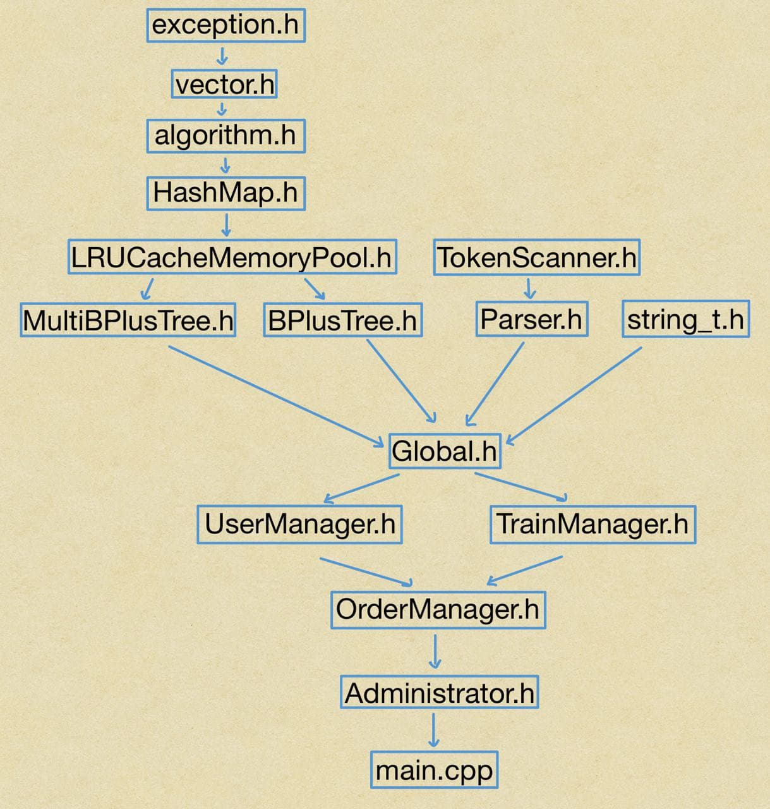

# TicketSystem:Automata Development Document

---

## 文件结构




## include

### algorithm.h

| 函数               | 功能                                      |
| ------------------ | ----------------------------------------- |
| sort && sortVector | 实现`stl`启发式算法的sort                 |
| lower_bound        | 同`std::lower_bound`，供`BPlusTree`类使用 |
| upper_bound        | 同`std::upper_bound`，供`BPlusTree`类使用 |
| find               | 同`std::find`，供`BPlusTree`类使用        |


### exceptions.h

一些从`std::exception`派生的类

用于`vector.h`的异常处理


### vector.h

同`std::vector`

用于存储数据


### string_t.h

将定长`char`数组封装成模板类（参数为字符串长度）

供文件交互使用


### HashMap.h

同`std::unordered_map`

供`LRUCache`与主程序逻辑使用


### LRUCacheMemoryPool.h

实现了`LRUCache`的存储池类

封装所有的文件读写操作


### BPlusTree.h

支持重复`key`值的`BPlusTree`

程序的基础数据结构


### TokenScanner.h

同`std::stringstream`

用于分割命令


### Parser.h

程序处理指令的核心

重载了`operator[]`

```c++
string cmd;
Parser p;
p.resetBuffer(cmd);
p["-a"];//返回cmd中-a的参数
```


## src

### Global.h

`include`所有的头文件，定义相关系数与哈希函数，一些宏定义

所有的`*Manager`均需`include`此头文件


### UserManager.h/.cpp

负责所有用户相关的操作

内嵌类：`user_t`

| 变量类型     | 变量名称  | 备注                      |
| ------------ | --------- | ------------------------- |
| string_t<20> | username  |                           |
| string_t<30> | password  |                           |
| string_t<20> | name      | 一个汉字占据4个char的空间 |
| string_t<30> | mailAddr  |                           |
| int          | privilege |                           |


成员变量：

| 成员变量类型                  | 成员变量名称 | 作用               |
| ----------------------------- | ------------ | ------------------ |
| HashMap<username, int>    | loginPool    | 存储用户登录态与权限  |
| BPlusTree<username, int>      | indexPool    | username的索引文件 |
| LRUCacheMemoryPool\<user_t> | storagePool  | 存储用户信息       |
| std::ostream&                 | defaultOut   | 输出信息           |


成员函数：

```c++
UserManager(const string &indexPath, const string &storagePath, std::ostream &dft);

bool isLogin(const username_t &u);//检查用户是否登录

void addUser(const Parser &parser);//构造一个userType类对象，写入storagePool与indexPool

void login(const Parser &parser);//更新loginPool

void logout(const Parser &parser);//更新loginPool

void queryProfile(const Parser &parser);//查找即可

void modifyProfile(const Parser &parser);//修改即可

void clear();//清空信息
```


### TrainManager.h/.cpp

负责所有火车相关的操作

内嵌类：

`train_time_t`

| 变量类型      | 变量名称 |
| ------------- | -------- |
| uint_fast32_t | value    |

实现程序中对于时间的处理

其中月、日、小时、分钟分别用8个byte存储


`ticket_t`

| 变量类型     | 变量名称                   |
| ------------ | -------------------------- |
| string_t<20> | trainID                    |
| string_t<40> | from, to                   |
| train_time_t | departureTime, arrivalTime |
| int          | time, price, seat          |

保存车票的相关信息


`train_t`

| 变量类型          | 变量名称       | 备注                           |
| ----------------- | -------------- | ------------------------------ |
| string_t<20>      | trainID        |                                |
| int               | stationNum     |                                |
| string_t<40>[100] | stations       | 一个汉字占据4个char的空间      |
| int               | seatNum        |                                |
| int[100]          | prices         |                                |
| Time              | startTime      |                                |
| train_time_t[100] | arrivalTimes   | **第一辆车**的各站到达时间     |
| train_time_t[100] | departureTimes | **第一辆车**的各站发车时间     |
| train_time_t      | startTime      | 发售车票第一天+发车时间        |
| train_time_t      | endTime        | 发售车票最后一天+发车时间      |
| char              | type           |                                |
| bool              | released       |                                |
| int[100]\[100]    | remainSeats    | 存储每天每站剩余的座位         |
| int               | dateGap        | 存储startTime与endTime的时间差 |


成员变量：

| 成员变量类型                           | 成员变量名称 | 作用                                       |
| -------------------------------------- | ------------ | ------------------------------------------ |
| BPlusTree<trainID, int>                | indexPool    | trainID的索引文件                          |
| LRUCacheMemoryPool\<train_t>           | storagePool  | 存储火车信息                               |
| BPlusTree<station, pair<trainID, int>> | stationPool  | 存储经过某站的所有车的ID，以及此站是第几站 |
| TokenScanner                           | splitTool    | 用于分割被\|分开的信息                     |
| std::ostream&                          | defaultOut   | 输出信息                                   |


成员函数：

```c++
TrainManager(const string &indexPath, const string &storagePath, const string &stationPath, std::ostream &dft);

void addTrain(const Parser &parser);//构造一个trainType类对象，写入storagePool与indexPool

void releaseTrain(const Parser &parser);//更新trainType类中released变量，对于经过的每一站在stationPool中添加元素

void queryTrain(const Parser &parser);//按照trainID查询，检查-d是否在saleDate内

void deleteTrain(const Parser &parser);//检查是否release

void queryTicket(const Parser &parser);//找到所有经过-s（筛选出-d为出发日期的车），-t的车，暴力搜索其中的重复元素

void queryTransfer(const Parser &parser);//找到所有经过-s（筛选出-d为出发日期的车），-t的车，分别称为t1，t2，对于t1的每个元素，加入hashmap，对于t2中每个元素，检查是否在hashmap中出现

void clear();//清空信息
```


### OrderManager.h/.cpp

负责所有订单相关的操作

内嵌类：`order_t`

| 变量类型     | 变量名称      | 备注                                                         |
| ------------ | ------------- | ------------------------------------------------------------ |
| string_t<20> | username      |                                                              |
| long long    | timeStamp     | 保存操作执行时的`ns`级时间戳，用于判断两个order是否相等<br />（存在订单信息完全相同的可能性） |
| enum         | status        |                                                              |
| string_t<20> | trainID       |                                                              |
| string_t<40> | fromStation   |                                                              |
| string_t<40> | toStation     |                                                              |
| train_time_t | departureTime |                                                              |
| train_time_t | arrivalTime   | 需在构造时读取火车的数据                                     |
| int          | price         |                                                              |
| int          | num           |                                                              |
| int          | from          | 出发站在火车中对应的index                                    |
| int          | to            | 到达站在火车中对应的index                                    |
| int          | dist          | 乘坐的火车发车日期距第一班该车次发车日期的距离，用于快速访问remainSeats |


成员变量：

| 成员变量类型                 | 成员变量名称 | 作用                          |
| ---------------------------- | ------------ | ----------------------------- |
| UserManager*                 | userManager  | 访问用户登录态                |
| TrainManager*                | trainManager | 读取火车信息                  |
| BPlusTree<username, order_t> | indexPool    | 存储每个用户的所有order       |
| BPlusTree<trainID, order_t>  | pendingPool  | 对于每辆车，存储pending的订单 |
| const string[3]              | status       | 用于快速print order           |
| std::ostream&                | defaultOut   | 输出信息                      |


成员函数：

```c++
OrderManager(UserManager *um, TrainManager *tm, const string &indexPath, const string &pendingPath, std::ostream &dft);

void buyTicket(const Parser &parser);//直接买，票如果不够的话加入pendingPool

void queryOrder(const Parser &parser);//直接在indexPool内查询即可

void refundTicket(const Parser &parser);//在indexPool内查询找到该订单，若为success：到pendingPool中按顺序解决所有pending的order，更新订单信息、火车信息；若为refund：在pendingPool中删除该订单

void clear();//清空信息
```


### Administrator.h/.cpp

负责整个程序的执行


成员变量：

| 变量类型      | 作用               |
| ------------- | ------------------ |
| string[]      | 存储各个文件的路径 |
| Parser*       | 处理指令           |
| UserManager*  | 处理用户操作       |
| TrainManager* | 处理火车操作       |
| OrderManager* | 处理订单操作       |
| std::istream& | 输入信息           |
| std::ostream& | 输出信息           |


成员函数：

```c++
Administrator(const string &path...);

void initialize();//初始化

void clean();//清空所有信息

void runProgramme();//处理指令，分解成子任务交给成员变量/自身去做
```


